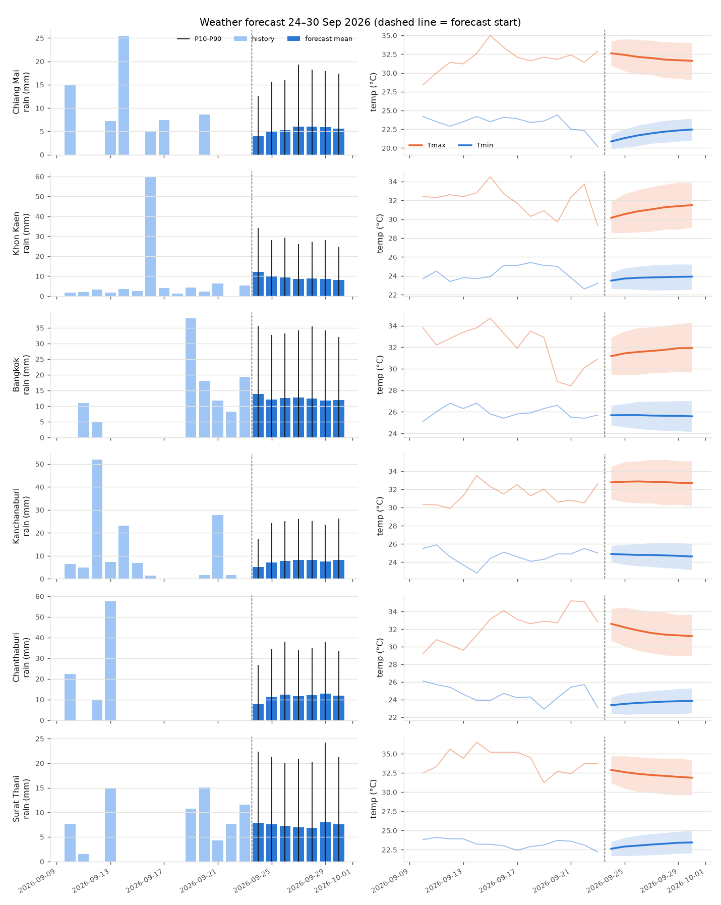
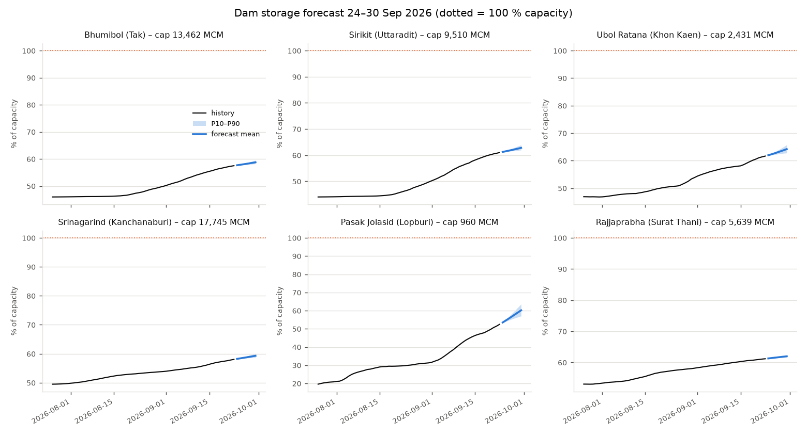

# Thailand Weather & Dam Water-Volume Forecast: 24–30 Sep 2026

A reproducible Python pipeline that forecasts, for **24–30 September 2026**:

* **Weather** at 6 regional stations: daily rainfall (amount, probability, heavy-rain
  probability), Tmax and Tmin, with uncertainty bands.
* **Water volume** in 6 major dams: daily storage (MCM and % of capacity), inflow,
  release and evaporation, with uncertainty bands.

Every forecast is a **1,000-member Monte-Carlo ensemble**. The pipeline also runs a
**10-year backtest** that scores the models against climatology and persistence.

> ⚠️ **Data caveat. Please read.** The build container could not reach TMD,
> ThaiWater/HII, RID or Open-Meteo, because outbound access was blocked. The run
> committed here (`outputs/`) therefore uses the **offline synthetic history**
> (`--source synthetic`). That history is a stochastic simulation calibrated to TMD
> monthly climate normals and published dam capacities and inflows. The modelling is
> real and fully fitted, but the **numbers are illustrative, not an official
> forecast**. Re-run on a machine with internet access, or drop real observations
> into `data/observed/`, and the same code produces a data-driven forecast. See
> [Using real data](#using-real-data).

## Quick start

```bash
pip install -r requirements.txt
python run_forecast.py                    # auto: data/observed CSV > Open-Meteo ERA5 > synthetic
python run_forecast.py --source synthetic # reproduce the committed outputs exactly
python run_forecast.py --no-backtest      # faster
```

Outputs (in `outputs/`):

| File | Content |
|---|---|
| `forecast_weather.csv` | per station & day: rain mean/P10/P50/P90, P(rain ≥ 1 mm), P(heavy ≥ 35.1 mm), Tmax/Tmin mean/P10/P90, climatology |
| `forecast_dams.csv` | per dam & day: storage mean/P10/P90 (MCM), % capacity, usable volume, inflow, release, evaporation, P(>80 %), P(>100 %) |
| `backtest_weather.csv`, `backtest_dams.csv` | hindcast verification metrics |
| `forecast.json` | everything above plus history and fitted coefficients (feeds the HTML report) |
| `figures/*.png` | static charts |

## Modelling

```
 historical daily data (2000 → 23 Sep 2026)
        │
        ├─► Weather model (per station) ──► 1000-member rain / Tmax / Tmin ensemble
        │                                            │  catchment rain
        └─► Dam model (per reservoir) ◄──────────────┘
               inflow (ridge regression) → release (fitted rule) → mass balance
                                            ▼
                         storage ensemble 24–30 Sep → mean, P10, P90, exceedance probs
```

### 1. Weather model: conditional stochastic weather generator (`weather_model.py`)

| Component | Model |
|---|---|
| Rain occurrence (≥ 1 mm) | Logistic regression: `logit P(wet_t) = β·[sin/cos harmonics k=1..3, wet_{t-1}, wet-day fraction of last 7 days, wet_{t-1}×season]` |
| Rain amount | Gamma distribution, MLE-fitted to wet days within ±20 days of the calendar date |
| Temperature climatology | OLS on 3 seasonal harmonic pairs + linear warming trend |
| Temperature anomaly | AR(2) + same-day rain *anomaly* term (wet − seasonal P(wet)); Gaussian noise with a month-specific σ |

The forecast starts from the observed state on 23 Sep: the last two temperature
anomalies and the last seven wet/dry days. It then simulates 1,000 members day by
day. Because persistence decays toward climatology, skill is highest on days 1–2.

### 2. Dam model: data-driven inflow, fitted operation rule, water balance (`dam_model.py`)

* **Catchment rain**: `P = 0.4·r_t + 0.6·mean(r_{t-2..t})` from the proxy station. The
  **antecedent precipitation index** is `API_t = 0.93·API_{t-1} + P_t`.
* **Inflow**: a ridge regression in log space,
  `log1p(I_t) = b0 + b1·log1p(I_{t-1}) + b2..b4·log1p(P_t, P_{t-1}, P_{t-2}) + b5·log1p(API_t) + harmonics + e_t`,
  where `e_t` is AR(1) noise. In-sample R² is about 0.98 for every dam.
* **Release**: `R_t = c0 + c1·R_{t-1} + c2·(S_{t-1} − RuleCurve_t) + harmonics + u_t`
  (OLS). This learns how operators track the monthly rule curve.
* **Evaporation**: `E_t = evap_mm(month) × A(S) × 10⁻³`, with `A(S) = A_full·(S/cap)^0.7`.
* **Mass balance**: `S_t = S_{t-1} + I_t − R_t − E_t`. Water above 102 % of capacity
  spills, and storage cannot drop below dead storage.

| Dam | Province | Capacity (MCM) | Rain proxy |
|---|---|---:|---|
| Bhumibol | Tak | 13,462 | Chiang Mai |
| Sirikit | Uttaradit | 9,510 | Chiang Mai |
| Ubol Ratana | Khon Kaen | 2,431 | Khon Kaen |
| Srinagarind | Kanchanaburi | 17,745 | Kanchanaburi |
| Pasak Jolasid | Lopburi | 960 | Bangkok |
| Rajjaprabha | Surat Thani | 5,639 | Surat Thani |

### 3. Validation: backtest

The models were trained on 2000–2015. Seven-day forecasts were then issued on
1, 3, …, 23 September of every year from 2016 to 2025 (120 hindcasts per site), with
300 members each. Skill = `1 − error_model / error_reference`, where the reference is
**climatology** for weather and **persistence** for dam storage.

| Station | Tmax MAE °C | Tmax skill | Tmin MAE °C | Tmin skill | Rain Brier skill | 7-day rain skill |
|---|---:|---:|---:|---:|---:|---:|
| Chiang Mai | 1.38 | +2.8 % | 0.90 | +17.6 % | +2.7 % | −0.7 % |
| Khon Kaen | 1.23 | +2.1 % | 0.79 | +16.0 % | +2.9 % | −0.9 % |
| Bangkok | 1.47 | +4.0 % | 0.83 | +8.0 % | +0.2 % | −1.7 % |
| Kanchanaburi | 1.37 | +6.5 % | 0.78 | +11.8 % | +3.3 % | +1.1 % |
| Chanthaburi | 1.44 | +11.5 % | 0.94 | +26.0 % | +5.3 % | +3.5 % |
| Surat Thani | 1.38 | +7.0 % | 0.72 | +5.8 % | +1.8 % | +1.8 % |

| Dam | Day-7 storage MAE (MCM) | as % of capacity | Skill vs persistence | Obs. inside P10–P90 |
|---|---:|---:|---:|---:|
| Bhumibol | 54.7 | 0.41 % | +76 % | 90 % |
| Sirikit | 56.7 | 0.60 % | +72 % | 87 % |
| Ubol Ratana | 37.7 | 1.55 % | +55 % | 68 % |
| Srinagarind | 55.0 | 0.31 % | +68 % | 68 % |
| Pasak Jolasid | 18.4 | 1.91 % | +64 % | 82 % |
| Rajjaprabha | 10.2 | 0.18 % | +73 % | 78 % |

**How to read the scores.** The temperature and dam-storage models are clearly
better than their baselines. A 7-day storage error below 2 % of capacity is useful
for operations. **Daily rainfall has almost no skill beyond climatology** at this
range. That is expected: purely statistical models cannot predict individual storms
more than a day or two ahead. The fix is to feed numerical weather prediction
(NWP) rain, such as ECMWF, GFS or the TMD WRF model, into the dam model in place of
the stochastic rain. The dam model accepts any `(members × days)` rain array.

## Results: 24–30 September 2026 (synthetic-history run)



| Station | Region | 7-day rain (mm, mean) | Expected rainy days | Max daily P(rain) | Max P(heavy ≥ 35 mm) | Mean Tmax °C | Mean Tmin °C |
|---|---|---:|---:|---:|---:|---:|---:|
| Chiang Mai | North | 37.5 | 3.3 | 51 % | 3 % | 32.0 | 21.8 |
| Khon Kaen | Northeast | 65.2 | 4.1 | 74 % | 10 % | 31.0 | 23.8 |
| Bangkok | Central | 87.1 | 5.1 | 82 % | 11 % | 31.6 | 25.6 |
| Kanchanaburi | West | 52.0 | 3.4 | 52 % | 6 % | 32.8 | 24.8 |
| Chanthaburi | East | 79.3 | 4.3 | 68 % | 11 % | 31.7 | 23.7 |
| Surat Thani | South | 51.9 | 4.6 | 73 % | 4 % | 32.3 | 23.1 |

**Weather summary.** This is a typical late-southwest-monsoon week. Rain is most
likely in **Bangkok/Central** (about 5 rainy days, around 87 mm) and in the **East**
and **Northeast**. The **North** is drying as the monsoon trough retreats south
(about 38 mm). The chance of a heavy-rain day (> 35 mm) peaks at about 10–11 % in
Bangkok, Chanthaburi and Khon Kaen. Temperatures stay near normal: highs of
31–33 °C and lows of 22–26 °C.



| Dam | Storage 24 Sep (MCM) | Storage 30 Sep (MCM) | P10–P90 on 30 Sep | % capacity 30 Sep | 7-day inflow (MCM) | 7-day release (MCM) |
|---|---:|---:|---:|---:|---:|---:|
| Bhumibol | 7,764 | 7,910 | 7,833 – 8,008 | 58.8 % | 190 | 17 |
| Sirikit | 5,826 | 5,974 | 5,892 – 6,077 | 62.8 % | 194 | 20 |
| Ubol Ratana | 1,507 | 1,561 | 1,527 – 1,599 | 64.2 % | 90 | 21 |
| Srinagarind | 10,335 | 10,523 | 10,422 – 10,655 | 59.3 % | 244 | 17 |
| Pasak Jolasid | 514 | 578 | 547 – 610 | 60.2 % | 96 | 19 |
| Rajjaprabha | 3,457 | 3,495 | 3,479 – 3,513 | 62.0 % | 57 | 10 |

**Water summary.** All six reservoirs keep filling through the week, since inflow
is far above release in the refill season. The forecast gains are +0.7 to
+1.5 percentage points for the large dams and about **+7 points for Pasak Jolasid**.
Pasak Jolasid is small relative to its catchment, so it responds fastest and has
the widest uncertainty band. No dam has a meaningful probability of reaching 80 %
or 100 % of capacity by 30 September.

## Using real data

1. **Weather**: run with internet access (`--source openmeteo`). ERA5 daily
   rain/Tmax/Tmin are downloaded for each station automatically. Alternatively, put
   `data/observed/weather_<station>.csv` (`date,rain,tmax,tmin`) there, for example
   from TMD.
2. **Dams**: put `data/observed/dam_<dam>.csv` (`date,storage,inflow,release`, in
   MCM per day) there, for example exported from ThaiWater (thaiwater.net), RID or
   EGAT daily reservoir reports.
3. Re-run `python run_forecast.py`. Observed files always take priority, and the
   provenance of every site is printed and stored in `forecast.json`.

Station keys: `chiangmai, khonkaen, bangkok, kanchanaburi, chanthaburi, suratthani`.
Dam keys: `bhumibol, sirikit, ubolratana, srinagarind, pasakjolasid, rajjaprabha`.

## Project layout

```
run_forecast.py              # fit → forecast → backtest → outputs
src/thai_forecast/
  config.py                  # forecast window, stations (TMD normals), dams (capacity, rule curves)
  data.py                    # loaders: observed CSV / Open-Meteo / synthetic generator; dam physics helpers
  weather_model.py           # stochastic weather generator
  dam_model.py               # inflow + release regressions and water-balance simulation
  plots.py                   # PNG figures
outputs/                     # committed results of the synthetic run
```
